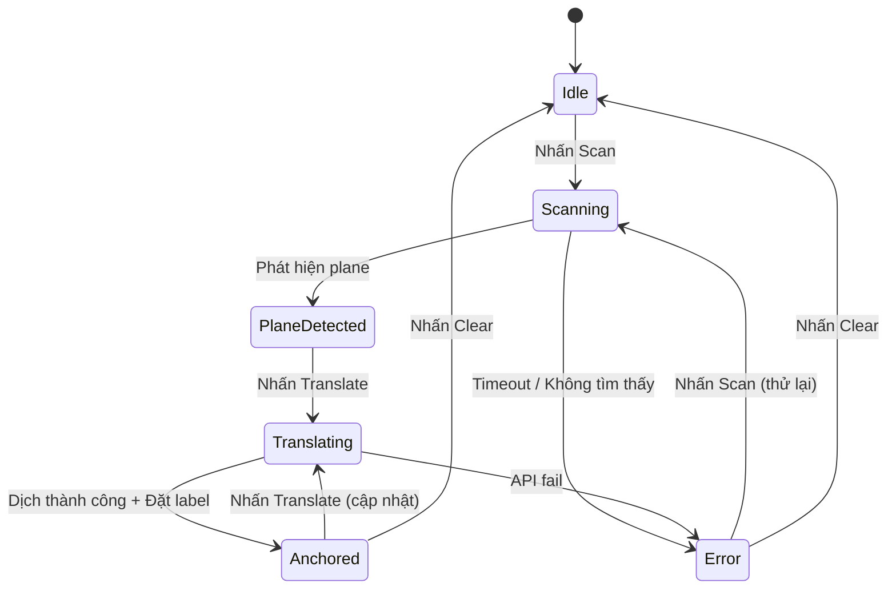
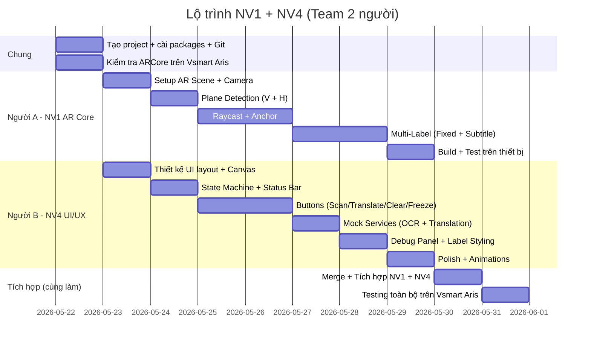

# Kế hoạch triển khai: Hệ thống Dịch Bài Giảng Real-time bằng AR

## Tổng quan dự án

Xây dựng ứng dụng Android sử dụng Unity + ARCore để:
1. Nhận diện mặt phẳng (bảng/slide — cả vertical lẫn horizontal) trong lớp học qua camera AR
2. Hiển thị text dịch **Anh → Việt** (ảo) được ghim lên vị trí thực tế trên slide/bảng
3. Hỗ trợ **2 loại label**: text cố định bám trên slide/bảng + phụ đề (subtitle) hiển thị phía dưới
4. Giao diện người dùng trực quan với các trạng thái hệ thống rõ ràng

Kế hoạch này bao gồm **Nhiệm vụ 1** (AR Core / Unity / Android Build) và **Nhiệm vụ 4** (UI/UX + Interaction Flow).

### Thông tin đã xác nhận

| Hạng mục | Chi tiết |
|---|---|
| **Ngôn ngữ dịch** | Anh → Việt |
| **Loại label** | 2 loại: (1) Text cố định bám trên slide/bảng, (2) Phụ đề (subtitle) |
| **Loại mặt phẳng** | Cả vertical (bảng/tường) và horizontal (bàn/sàn) |
| **Thiết bị test** | Vsmart Aris, VOS 4.0, Android 11 |
| **Team size** | 2 người |

---

## 1. Môi trường phát triển & Công cụ

### IDE & Editor

| Công cụ | Phiên bản khuyến nghị | Mục đích |
|---|---|---|
| **Unity Editor** | **2022.3 LTS** (Long Term Support) | Engine chính để phát triển AR |
| **Visual Studio 2022** hoặc **JetBrains Rider** | Mới nhất | Code editor cho C# scripts |
| **Android Studio** | Mới nhất (Ladybug+) | Quản lý Android SDK, emulator debug |

> [!IMPORTANT]
> Nên dùng **Unity 2022.3 LTS** vì đây là phiên bản ổn định nhất, được AR Foundation hỗ trợ tốt. Tránh dùng Unity 6 (2023.x) vì API có thay đổi breaking.

### Yêu cầu phần cứng

| Yêu cầu | Chi tiết |
|---|---|
| **Điện thoại Android** | Vsmart Aris (Android 11) — xem cảnh báo bên dưới |
| **Cáp USB** | Để build & debug trực tiếp lên thiết bị |
| **PC/Laptop** | Windows 10/11, RAM ≥ 16GB, GPU rời (khuyến nghị) |

> [!WARNING]
> **Về thiết bị Vsmart Aris**: Theo danh sách chính thức của Google, chỉ có **Vsmart Aris Pro** được chứng nhận ARCore. Model **Vsmart Aris** (không Pro) **có thể không được hỗ trợ chính thức**.
>
> **Cách kiểm tra:**
> 1. Trên điện thoại, vào Google Play Store, tìm "Google Play Services for AR"
> 2. Nếu cài được → thiết bị hỗ trợ ARCore
> 3. Nếu không tìm thấy hoặc không tương thích → cần đổi thiết bị test
>
> **Phương án dự phòng**: Nếu Vsmart Aris không hỗ trợ, có thể mượn điện thoại Samsung Galaxy A/S series, Xiaomi Redmi Note 10+, hoặc bất kỳ thiết bị nào trong [danh sách ARCore](https://developers.google.com/ar/devices).

### Android SDK Requirements

| Component | Version |
|---|---|
| Android SDK Platform | API Level 30+ (Android 11+) |
| Android Build Tools | 30.0.x trở lên |
| Android NDK | r23b (Unity sẽ cài tự động) |
| Minimum API Level | 24 (Android 7.0) |
| Target API Level | 33+ (Android 13+) |

---

## 2. Thư viện & Packages cần cài đặt

### Unity Packages (qua Package Manager)

| Package | Version | Mục đích |
|---|---|---|
| **AR Foundation** | 5.1.x | Framework AR đa nền tảng của Unity |
| **ARCore XR Plugin** | 5.1.x | Backend ARCore cho Android |
| **XR Interaction Toolkit** | 2.5.x | (Tùy chọn) Hỗ trợ tương tác XR |
| **TextMeshPro** | Có sẵn | Render text chất lượng cao trong 3D |

> [!NOTE]
> AR Foundation là abstraction layer, ARCore XR Plugin là implementation cụ thể cho Android. Cả hai cần cùng major version (5.x).

### Packages hỗ trợ (tùy chọn, cho Nhiệm vụ sau)

| Package | Mục đích |
|---|---|
| **NuGetForUnity** | Quản lý .NET packages |
| **UniTask** | Async/await tối ưu cho Unity |
| **DOTween** | Animation cho UI transitions |

---

## 3. Thiết lập Project Unity

### Bước 3.1: Tạo Unity Project

```
1. Mở Unity Hub → New Project
2. Template: chọn "3D (URP)" hoặc "3D Core"
   → Khuyến nghị "3D Core" để đơn giản, nhẹ hơn
3. Đặt tên project: "AR-Lecture-Translator"
4. Chọn thư mục lưu project
5. Nhấn "Create Project"
```

> [!TIP]
> Nếu chọn URP (Universal Render Pipeline) thì UI sẽ đẹp hơn nhưng setup phức tạp hơn. Với prototype, **3D Core** là đủ.

### Bước 3.2: Cài đặt AR Packages

```
1. Window → Package Manager
2. Nhấn "+" → "Add package by name"
3. Thêm lần lượt:
   - com.unity.xr.arfoundation
   - com.unity.xr.arcore
4. Đợi Unity resolve dependencies
5. Import TextMeshPro Essentials (nếu chưa có)
```

### Bước 3.3: Cấu hình Project Settings

#### Player Settings (Edit → Project Settings → Player)

```
Platform: Android
- Company Name: [tên nhóm]
- Product Name: AR Lecture Translator
- Package Name: com.team.arlecturetranslator

Other Settings:
- Minimum API Level: Android 7.0 (API 24)
- Target API Level: Automatic (highest installed)
- Scripting Backend: IL2CPP
- Target Architectures: ARM64 ✓ (bỏ chọn ARMv7 nếu không cần)
- Graphics APIs: Bỏ "Auto Graphics API", chỉ giữ OpenGLES3
```

> [!WARNING]
> **Bắt buộc phải đổi Scripting Backend sang IL2CPP** và chọn **ARM64**. ARCore không hoạt động với Mono backend trên các thiết bị mới.

#### XR Plug-in Management (Project Settings → XR Plug-in Management)

```
1. Tab Android → Check "ARCore"
2. Tab Android → ARCore settings:
   - Requirement: Required
   - Depth: Disabled (chưa cần)
```

---

## 4. Cấu trúc thư mục Project

```
Assets/
├── Scenes/
│   ├── MainScene.unity          # Scene chính chứa AR + UI
│   └── BootScene.unity          # (Tùy chọn) Splash/loading
│
├── Scripts/
│   ├── AR/
│   │   ├── ARPlaneManager.cs        # Quản lý plane detection (nếu mở rộng)
│   │   ├── ARRaycastController.cs   # Xử lý raycast từ screen → plane
│   │   ├── ARAnchorManager.cs       # Tạo và quản lý anchors
│   │   └── ARLabelPlacer.cs         # Đặt text label lên anchor
│   │
│   ├── UI/
│   │   ├── UIManager.cs            # Quản lý UI tổng thể
│   │   ├── StateManager.cs         # Quản lý trạng thái hệ thống
│   │   ├── ButtonController.cs     # Xử lý sự kiện nút bấm
│   │   └── DebugPanelController.cs # Panel debug hiển thị OCR/dịch
│   │
│   ├── Services/
│   │   ├── MockTranslationService.cs # Mock service cho demo
│   │   ├── ITranslationService.cs    # Interface cho service
│   │   └── MockOCRService.cs         # Mock OCR service
│   │
│   └── Models/
│       ├── TranslationResult.cs     # Data model cho kết quả dịch
│       └── AppState.cs              # Enum/model cho trạng thái app
│
├── Prefabs/
│   ├── ARLabel.prefab           # Prefab cho text label 3D
│   ├── TranslatedTextPanel.prefab # Panel hiển thị text dịch
│   └── PlaneVisualizer.prefab   # Visualizer cho detected plane
│
├── Materials/
│   ├── LabelBackground.mat      # Material nền cho label
│   ├── PlaneVisualizerMat.mat   # Material cho plane overlay
│   └── UIGlass.mat              # Material glassmorphism cho UI
│
├── Fonts/
│   └── NotoSansVN-Regular.ttf   # Font hỗ trợ tiếng Việt
│
└── UI/
    ├── Sprites/                 # Icons, backgrounds
    └── Animations/              # UI animation clips
```

---

## 5. Nhiệm vụ 1: AR Core / Unity / Android Build

### 5.1 Thiết lập AR Scene cơ bản

#### Bước 5.1.1: Tạo AR Session

```
Trong MainScene.unity:
1. Xóa Main Camera mặc định
2. GameObject → XR → AR Session
3. GameObject → XR → XR Origin (Mobile AR)
   → Tự động tạo: XR Origin > Camera Offset > AR Camera
4. Kiểm tra AR Camera có component:
   - Camera
   - AR Camera Manager
   - AR Camera Background
```

#### Bước 5.1.2: Thêm AR Components vào XR Origin

```
Chọn XR Origin GameObject, thêm components:
1. AR Plane Manager
   - Detection Mode: Everything (detect cả Vertical + Horizontal)
   - Plane Prefab: gán PlaneVisualizer prefab
2. AR Raycast Manager
   → Không cần config thêm
3. AR Anchor Manager
   → Không cần config thêm
```

> [!NOTE]
> Đã xác nhận cần detect **cả hai loại** mặt phẳng (vertical cho bảng/tường, horizontal cho bàn), nên dùng **Detection Mode = Everything**.

### 5.2 Plane Detection cho bảng/slide

#### PlaneVisualizer Prefab

```csharp
// Tạo Prefab cho việc hiển thị plane đã detect
// 1. Tạo Empty GameObject "PlaneVisualizer"
// 2. Thêm components:
//    - AR Plane (tự động thêm khi gán làm Plane Prefab)
//    - Mesh Renderer
//    - AR Plane Mesh Visualizer
//    - Line Renderer (cho viền plane)
// 3. Gán material bán trong suốt (semi-transparent)
```

Material cho plane:
```
- Shader: Universal Render Pipeline/Lit (hoặc Standard)
- Surface Type: Transparent
- Color: rgba(0, 200, 255, 0.3) — xanh nhạt bán trong suốt
```

### 5.3 Raycast từ màn hình vào mặt phẳng

```csharp
// ARRaycastController.cs
using System.Collections.Generic;
using UnityEngine;
using UnityEngine.XR.ARFoundation;
using UnityEngine.XR.ARSubsystems;

public class ARRaycastController : MonoBehaviour
{
    [SerializeField] private ARRaycastManager raycastManager;
    
    private List<ARRaycastHit> hits = new List<ARRaycastHit>();
    
    /// <summary>
    /// Thực hiện raycast từ vị trí screen vào các plane đã detect
    /// </summary>
    public bool TryRaycast(Vector2 screenPosition, out Pose hitPose)
    {
        hitPose = Pose.identity;
        
        if (raycastManager.Raycast(screenPosition, hits, 
            TrackableType.PlaneWithinPolygon))
        {
            hitPose = hits[0].pose;
            return true;
        }
        return false;
    }
    
    /// <summary>
    /// Raycast từ trung tâm màn hình
    /// </summary>
    public bool TryRaycastFromCenter(out Pose hitPose)
    {
        Vector2 center = new Vector2(Screen.width / 2f, Screen.height / 2f);
        return TryRaycast(center, out hitPose);
    }
}
```

### 5.4 Tạo Anchor

```csharp
// ARAnchorPlacer.cs
using UnityEngine;
using UnityEngine.XR.ARFoundation;

public class ARAnchorPlacer : MonoBehaviour
{
    [SerializeField] private ARAnchorManager anchorManager;
    [SerializeField] private ARRaycastController raycastController;
    
    /// <summary>
    /// Tạo anchor tại vị trí raycast hit.
    /// Anchor giúp text bám ổn định khi di chuyển điện thoại.
    /// </summary>
    public ARAnchor PlaceAnchor(Pose pose)
    {
        // Tạo GameObject rồi thêm ARAnchor component
        GameObject anchorGO = new GameObject("TranslationAnchor");
        anchorGO.transform.SetPositionAndRotation(pose.position, pose.rotation);
        
        ARAnchor anchor = anchorGO.AddComponent<ARAnchor>();
        return anchor;
    }
}
```

### 5.5 Render nhãn dịch bám vào vị trí thật — Hệ thống Multi-Label

Dự án cần hỗ trợ **2 loại label** đồng thời:

| Loại | Mô tả | Vị trí | Hành vi |
|---|---|---|---|
| **Fixed Label** | Text cố định bám trên slide/bảng | Anchor trên plane (World Space) | Bám vào vị trí thực, không di chuyển theo camera |
| **Subtitle Label** | Phụ đề dịch real-time | Screen Space, phía dưới màn hình | Luôn hiện trước mặt, giống phụ đề phim |

#### Prefab cho Fixed Label (World Space)

```
FixedARLabel (Prefab) — bám trên slide/bảng
├── AnchorRoot (Empty, parent vào ARAnchor)
│   └── Canvas (World Space)
│       ├── RectTransform: width=0.3, height=0.08 (mét)
│       └── LabelContainer (Horizontal Layout)
│           ├── AccentBar (Image, left, 4px, cyan)
│           ├── Background (Image, dark navy 85% opacity)
│           │   └── TranslatedText (TextMeshProUGUI, white)
│           └── LanguageBadge ("EN→VI", small)
```

#### Prefab cho Subtitle Label (Screen Space)

```
SubtitlePanel — phụ đề phía dưới màn hình
├── Canvas (Screen Space - Overlay)
│   └── SubtitleContainer (anchored bottom-center)
│       ├── Background (Image, dark semi-transparent, rounded)
│       └── SubtitleText (TextMeshProUGUI, white, center aligned)
```

```csharp
// LabelType.cs
public enum LabelType
{
    Fixed,      // Text cố định bám trên slide/bảng
    Subtitle    // Phụ đề hiển thị phía dưới màn hình
}
```

```csharp
// ARLabelPlacer.cs — Hỗ trợ multi-label
using System.Collections.Generic;
using UnityEngine;
using TMPro;
using UnityEngine.XR.ARFoundation;

public class ARLabelPlacer : MonoBehaviour
{
    [Header("Prefabs")]
    [SerializeField] private GameObject fixedLabelPrefab;    // World Space label
    [SerializeField] private GameObject subtitlePrefab;       // Screen Space subtitle
    
    [Header("References")]
    [SerializeField] private ARAnchorPlacer anchorPlacer;
    [SerializeField] private ARRaycastController raycastController;
    [SerializeField] private Transform subtitleContainer;     // Parent cho subtitle
    
    // Quản lý nhiều label cùng lúc
    private List<GameObject> fixedLabels = new List<GameObject>();
    private GameObject currentSubtitle;
    
    /// <summary>
    /// Đặt Fixed Label bám trên slide/bảng tại vị trí tap
    /// Có thể đặt nhiều label cùng lúc
    /// </summary>
    public void PlaceFixedLabel(string translatedText, Vector2 screenPos)
    {
        if (raycastController.TryRaycast(screenPos, out Pose hitPose))
        {
            // Tạo anchor để text bám ổn định
            ARAnchor anchor = anchorPlacer.PlaceAnchor(hitPose);
            
            // Instantiate label dưới anchor
            GameObject label = Instantiate(fixedLabelPrefab, anchor.transform);
            label.transform.localPosition = Vector3.zero;
            
            // Set text
            var textComp = label.GetComponentInChildren<TextMeshProUGUI>();
            if (textComp != null)
                textComp.text = translatedText;
            
            fixedLabels.Add(label);
        }
    }
    
    /// <summary>
    /// Hiển thị/cập nhật Subtitle ở dưới màn hình
    /// Chỉ có 1 subtitle tại 1 thời điểm
    /// </summary>
    public void ShowSubtitle(string translatedText)
    {
        if (currentSubtitle == null)
        {
            currentSubtitle = Instantiate(subtitlePrefab, subtitleContainer);
        }
        
        var textComp = currentSubtitle.GetComponentInChildren<TextMeshProUGUI>();
        if (textComp != null)
            textComp.text = translatedText;
    }
    
    /// <summary>
    /// Ẩn subtitle
    /// </summary>
    public void HideSubtitle()
    {
        if (currentSubtitle != null)
        {
            Destroy(currentSubtitle);
            currentSubtitle = null;
        }
    }
    
    /// <summary>
    /// Xóa tất cả Fixed Labels (giữ subtitle)
    /// </summary>
    public void ClearFixedLabels()
    {
        foreach (var label in fixedLabels)
        {
            if (label != null)
            {
                // Xóa cả anchor parent
                var anchor = label.GetComponentInParent<ARAnchor>();
                if (anchor != null)
                    Destroy(anchor.gameObject);
                else
                    Destroy(label);
            }
        }
        fixedLabels.Clear();
    }
    
    /// <summary>
    /// Xóa tất cả (cả Fixed + Subtitle)
    /// </summary>
    public void ClearAll()
    {
        ClearFixedLabels();
        HideSubtitle();
    }
}
```

### 5.6 Build & Deploy lên Android

```
Bước build:
1. File → Build Settings
2. Platform: Android → Switch Platform
3. Add Open Scenes (MainScene)
4. Player Settings: kiểm tra lại settings ở Bước 3.3
5. Bật USB Debugging trên điện thoại
6. Build And Run

Lần đầu build sẽ mất ~5-10 phút (IL2CPP compilation).
Các lần sau sẽ nhanh hơn (~2-3 phút).
```

> [!TIP]
> Để debug nhanh, bật **Development Build** và **Script Debugging** trong Build Settings. Có thể dùng `adb logcat` trong terminal để xem Unity logs.

---

## 6. Nhiệm vụ 4: UI/UX + Interaction Flow

### 6.1 Thiết kế màn hình chính

#### Layout tổng thể

```
┌────────────────────────────────┐
│          AR Camera View        │
│                                │
│    ┌──────────────────────┐    │
│    │ [Translated Text AR] │    │  ← Text ảo bám vào slide
│    └──────────────────────┘    │
│                                │
│  ┌──────────────────────────┐  │
│  │  Status: Scanning...     │  │  ← Status bar
│  └──────────────────────────┘  │
│                                │
│  ┌────┐ ┌─────────┐ ┌─────┐   │
│  │Scan│ │Translate │ │Clear│   │  ← Action buttons
│  └────┘ └─────────┘ └─────┘   │
│          ┌──────┐              │
│          │Freeze│              │  ← Freeze button
│          └──────┘              │
│                                │
│  ┌──────────────────────────┐  │
│  │ Debug Panel (collapsible)│  │  ← Debug info
│  │ OCR: "original text..."  │  │
│  │ Translated: "bản dịch.." │  │
│  └──────────────────────────┘  │
└────────────────────────────────┘
```

### 6.2 Hệ thống trạng thái (State Machine)

```csharp
// AppState.cs
public enum AppState
{
    Idle,           // Chờ, chưa làm gì
    Scanning,       // Đang scan plane / tìm bảng
    PlaneDetected,  // Đã phát hiện plane, sẵn sàng
    Translating,    // Đang dịch (chờ kết quả)
    Anchored,       // Text đã được anchor, hiển thị ổn định
    Error           // Lỗi (mất tracking, API fail, v.v.)
}
```

```csharp
// StateManager.cs
using UnityEngine;
using UnityEngine.Events;
using TMPro;
using UnityEngine.UI;

public class StateManager : MonoBehaviour
{
    [SerializeField] private TextMeshProUGUI statusText;
    [SerializeField] private Image statusBackground;
    
    public UnityEvent<AppState> OnStateChanged;
    
    private AppState currentState = AppState.Idle;
    
    public AppState CurrentState => currentState;
    
    public void SetState(AppState newState)
    {
        if (currentState == newState) return;
        
        currentState = newState;
        UpdateStatusUI();
        OnStateChanged?.Invoke(newState);
    }
    
    private void UpdateStatusUI()
    {
        switch (currentState)
        {
            case AppState.Idle:
                statusText.text = "Sẵn sàng";
                statusBackground.color = new Color(0.5f, 0.5f, 0.5f, 0.7f);
                break;
            case AppState.Scanning:
                statusText.text = "🔍 Đang quét...";
                statusBackground.color = new Color(0.2f, 0.6f, 1f, 0.7f);
                break;
            case AppState.PlaneDetected:
                statusText.text = "✅ Đã phát hiện bảng/slide";
                statusBackground.color = new Color(0.2f, 0.8f, 0.4f, 0.7f);
                break;
            case AppState.Translating:
                statusText.text = "⏳ Đang dịch...";
                statusBackground.color = new Color(1f, 0.8f, 0.2f, 0.7f);
                break;
            case AppState.Anchored:
                statusText.text = "📌 Đã ghim bản dịch";
                statusBackground.color = new Color(0.2f, 0.8f, 0.4f, 0.7f);
                break;
            case AppState.Error:
                statusText.text = "❌ Lỗi — Thử lại";
                statusBackground.color = new Color(1f, 0.3f, 0.3f, 0.7f);
                break;
        }
    }
}
```

### 6.3 Nút bấm: Scan / Translate / Clear / Freeze

```csharp
// ButtonController.cs
using UnityEngine;
using UnityEngine.UI;

public class ButtonController : MonoBehaviour
{
    [Header("References")]
    [SerializeField] private StateManager stateManager;
    [SerializeField] private ARLabelPlacer labelPlacer;
    [SerializeField] private ARRaycastController raycastController;
    [SerializeField] private MockTranslationService translationService;
    
    [Header("Buttons")]
    [SerializeField] private Button scanButton;
    [SerializeField] private Button translateButton;
    [SerializeField] private Button clearButton;
    [SerializeField] private Button freezeButton;
    
    [Header("Debug")]
    [SerializeField] private DebugPanelController debugPanel;
    
    private bool isFrozen = false;
    
    private void Start()
    {
        scanButton.onClick.AddListener(OnScanPressed);
        translateButton.onClick.AddListener(OnTranslatePressed);
        clearButton.onClick.AddListener(OnClearPressed);
        freezeButton.onClick.AddListener(OnFreezePressed);
        
        UpdateButtonStates();
    }
    
    private void OnScanPressed()
    {
        stateManager.SetState(AppState.Scanning);
        // Bật plane detection
        // AR Plane Manager sẽ tự động detect
        // Khi detect thành công → chuyển sang PlaneDetected
    }
    
    private async void OnTranslatePressed()
    {
        stateManager.SetState(AppState.Translating);
        
        // Mock: giả lập OCR + Translation
        var result = await translationService.TranslateAsync(
            "Sample lecture text on slide");
        
        debugPanel?.UpdateOCRText(result.OriginalText);
        debugPanel?.UpdateTranslatedText(result.TranslatedText);
        
        // Đặt label tại trung tâm màn hình
        Vector2 center = new Vector2(
            Screen.width / 2f, Screen.height / 2f);
        labelPlacer.PlaceLabel(result.TranslatedText, center);
        
        stateManager.SetState(AppState.Anchored);
    }
    
    private void OnClearPressed()
    {
        labelPlacer.ClearAllLabels();
        debugPanel?.ClearAll();
        stateManager.SetState(AppState.Idle);
    }
    
    private void OnFreezePressed()
    {
        isFrozen = !isFrozen;
        // Freeze: tạm dừng tracking/update để giữ nguyên vị trí
        // Có thể disable AR Plane Manager tạm thời
    }
    
    private void UpdateButtonStates()
    {
        // Enable/disable buttons dựa trên state
        var state = stateManager.CurrentState;
        translateButton.interactable = 
            (state == AppState.PlaneDetected || state == AppState.Anchored);
        clearButton.interactable = (state == AppState.Anchored);
    }
}
```

### 6.4 Mock Service cho demo

```csharp
// ITranslationService.cs
using System.Threading.Tasks;

public interface ITranslationService
{
    Task<TranslationResult> TranslateAsync(string sourceText);
}

// TranslationResult.cs
[System.Serializable]
public class TranslationResult
{
    public string OriginalText;
    public string TranslatedText;
    public string SourceLanguage;
    public string TargetLanguage;
}

// MockTranslationService.cs
using System.Threading.Tasks;
using UnityEngine;

public class MockTranslationService : MonoBehaviour, ITranslationService
{
    [SerializeField] private float mockDelaySeconds = 1.5f;
    
    public async Task<TranslationResult> TranslateAsync(string sourceText)
    {
        // Giả lập delay mạng
        await Task.Delay((int)(mockDelaySeconds * 1000));
        
        return new TranslationResult
        {
            OriginalText = sourceText,
            TranslatedText = "[VN] Đây là bản dịch mẫu của: " 
                             + sourceText,
            SourceLanguage = "en",
            TargetLanguage = "vi"
        };
    }
}
```

### 6.5 Thiết kế Label — 2 loại: Fixed + Subtitle

#### 6.5.1 Fixed Label (bám trên slide/bảng) — Style chi tiết

```
FixedARLabel Prefab:
├── AnchorRoot (Empty, parent vào ARAnchor)
│   └── Canvas (World Space)
│       ├── RectTransform: width=0.3, height=0.08 (mét)
│       ├── Canvas Scaler: không dùng (World Space tự scale)
│       │
│       └── LabelContainer (Horizontal Layout Group)
│           ├── AccentBar (Image, left side)
│           │   - Width: 4px, Height: stretch
│           │   - Color: #00D2FF (Cyan)
│           │
│           ├── ContentArea (Vertical Layout)
│           │   ├── TranslatedText (TextMeshProUGUI)
│           │   │   - Font: Noto Sans Vietnamese Bold
│           │   │   - Size: 24 (world space scale ~0.005)
│           │   │   - Color: #FFFFFF
│           │   │   - Alignment: Left, Middle
│           │   │
│           │   └── OriginalText (TextMeshProUGUI, optional)
│           │       - Font size: 16 (nhỏ hơn)
│           │       - Color: #A0AEC0 (gray)
│           │       - Italic
│           │
│           └── LanguageBadge
│               - Text: "EN→VI"
│               - Background: #667EEA
│               - Corner Radius: 8px
│               - Padding: 4px 8px
│
│       Background (Image, behind all)
│           - Color: rgba(15, 15, 30, 0.85) — dark navy
│           - Corner Radius: 12px (sprite 9-slice)
│           - Outline: 1px #667EEA20
```

#### 6.5.2 Subtitle Label (phụ đề dưới màn hình) — Style chi tiết

```
SubtitlePanel Prefab:
├── Canvas (Screen Space - Overlay, sort order cao)
│   └── SubtitleContainer (Anchored: bottom-center)
│       ├── Margin bottom: 120px (tránh nút bấm)
│       ├── Max width: 80% screen width
│       │
│       ├── Background (Image)
│       │   - Color: rgba(0, 0, 0, 0.7) — black semi-transparent
│       │   - Corner Radius: 16px
│       │   - Blur effect (nếu có shader)
│       │
│       └── SubtitleText (TextMeshProUGUI)
│           - Font: Noto Sans Vietnamese
│           - Size: 28sp
│           - Color: #FFFFFF
│           - Alignment: Center
│           - Text Wrapping: enabled
│           - Padding: 16px 24px
│           - Outline: 1px black (dễ đọc trên mọi background)
```

#### Style Guidelines cho cả 2 loại Label

```
1. ĐỌC ĐƯỢC: Nền tối + chữ trắng → dễ đọc trên mọi background
2. KHÔNG CHE HẾT SLIDE: Fixed label semi-transparent, kích thước vừa phải
3. DỄ PHÂN BIỆT: Fixed label có accent bar cyan, subtitle có nền đen
4. BILLBOARD: Fixed label luôn xoay hướng về camera
5. SUBTITLE RIÊNG: Phụ đề luôn nằm cố định dưới màn hình, không bám AR
6. FONT TIẾNG VIỆT: Bắt buộc dùng Noto Sans Vietnamese (hỗ trợ dấu)
```

```csharp
// LabelBillboard.cs — Giúp label luôn hướng về camera
using UnityEngine;

public class LabelBillboard : MonoBehaviour
{
    private Camera arCamera;
    
    void Start()
    {
        arCamera = Camera.main;
    }
    
    void LateUpdate()
    {
        if (arCamera != null)
        {
            // Xoay label để hướng về camera
            transform.LookAt(
                transform.position + arCamera.transform.forward);
        }
    }
}
```

### 6.6 Debug Panel

```csharp
// DebugPanelController.cs
using UnityEngine;
using UnityEngine.UI;
using TMPro;

public class DebugPanelController : MonoBehaviour
{
    [SerializeField] private GameObject panelRoot;
    [SerializeField] private TextMeshProUGUI ocrTextField;
    [SerializeField] private TextMeshProUGUI translatedTextField;
    [SerializeField] private TextMeshProUGUI fpsText;
    [SerializeField] private TextMeshProUGUI trackingStateText;
    [SerializeField] private Button toggleButton;
    
    private bool isVisible = false;
    
    void Start()
    {
        toggleButton.onClick.AddListener(TogglePanel);
        panelRoot.SetActive(false);
    }
    
    void Update()
    {
        if (isVisible)
        {
            fpsText.text = $"FPS: {1f / Time.deltaTime:F0}";
        }
    }
    
    public void TogglePanel()
    {
        isVisible = !isVisible;
        panelRoot.SetActive(isVisible);
    }
    
    public void UpdateOCRText(string text)
    {
        ocrTextField.text = $"OCR Raw:\n{text}";
    }
    
    public void UpdateTranslatedText(string text)
    {
        translatedTextField.text = $"Translated:\n{text}";
    }
    
    public void UpdateTrackingState(string state)
    {
        trackingStateText.text = $"Tracking: {state}";
    }
    
    public void ClearAll()
    {
        ocrTextField.text = "OCR Raw: —";
        translatedTextField.text = "Translated: —";
    }
}
```

### 6.7 UI Styling — Thiết kế đẹp, hiện đại

#### Color Palette

```
Primary:      #667EEA (Indigo-blue)
Secondary:    #764BA2 (Purple)
Accent:       #00D2FF (Cyan)
Background:   #0F0F1E (Dark Navy)
Surface:      #1A1A2E (Darker surface)
Text Primary: #FFFFFF
Text Secondary: #A0AEC0 (Gray-blue)
Success:      #48BB78 (Green)
Warning:      #ECC94B (Yellow)
Error:        #FC8181 (Red)
```

#### Button Styling

```
Nút bấm chính (Scan, Translate):
- Background: gradient(Primary → Secondary)
- Corner Radius: 16px
- Padding: 16px 32px
- Font: Bold, 16sp
- Shadow: 0 4px 15px rgba(102, 126, 234, 0.4)
- Hover/Press: scale(0.95), opacity 0.9

Nút phụ (Clear, Freeze):
- Background: Surface color, border 1px accent
- Corner Radius: 12px
- Font: Medium, 14sp

Nút Freeze (toggle):
- Active state: Background cyan, icon ❄️
- Inactive state: Background transparent, border only
```

#### Canvas UI Hierarchy

```
UICanvas (Screen Space - Overlay)
├── SafeArea
│   ├── TopBar
│   │   ├── AppTitle ("AR Translator")
│   │   └── SettingsButton (⚙️)
│   │
│   ├── StatusBar (middle-bottom area)
│   │   ├── StatusIcon (animated)
│   │   └── StatusText
│   │
│   ├── ActionBar (bottom)
│   │   ├── ScanButton
│   │   ├── TranslateButton (larger, prominent)
│   │   ├── ClearButton
│   │   └── FreezeButton
│   │
│   ├── DebugPanel (bottom-left, collapsible)
│   │   ├── ToggleDebugButton (🔧)
│   │   ├── OCRTextArea (ScrollView)
│   │   ├── TranslatedTextArea (ScrollView)
│   │   ├── FPSCounter
│   │   └── TrackingStateLabel
│   │
│   └── CrosshairCenter (✚ marker, chỉ vị trí raycast)
```

---

## 7. Flow tương tác tổng thể



---

## 8. Checklist đầu ra cần bàn giao

### Nhiệm vụ 1: AR Core / Unity / Android Build

| # | Đầu ra | Tiêu chí hoàn thành |
|---|---|---|
| 1 | Unity project chạy được | Build APK thành công, cài được lên điện thoại |
| 2 | AR Camera hoạt động | Camera hiện hình ảnh thực từ điện thoại |
| 3 | Plane detection hoạt động | Phát hiện và hiển thị mặt phẳng (bảng/tường) |
| 4 | Nút "Place Label" hoạt động | Nhấn nút → text giả xuất hiện trên plane |
| 5 | Text bám ổn định | Di chuyển điện thoại, text không trôi/nhảy |
| 6 | Raycast hoạt động | Tap vào plane → text xuất hiện đúng vị trí |

### Nhiệm vụ 4: UI/UX + Interaction Flow

| # | Đầu ra | Tiêu chí hoàn thành |
|---|---|---|
| 1 | Màn hình chính app | Layout đầy đủ: camera, buttons, status |
| 2 | Các nút hoạt động với mock | Scan/Translate/Clear/Freeze đều phản hồi |
| 3 | Trạng thái hệ thống | Status bar thay đổi theo từng hành động |
| 4 | Label style đẹp, dễ nhìn | Nền tối, chữ trắng, có accent, đọc được |
| 5 | Debug panel | Hiển thị OCR raw text + translated text |
| 6 | UI animation | Buttons có hiệu ứng press, status có transition |

---

## 9. Phân chia công việc cho Team 2 người

### Phân vai trò

| Thành viên | Vai trò | Phụ trách chính |
|---|---|---|
| **Người A** | AR Developer | NV1: AR Core, Plane Detection, Raycast, Anchor, Label Placement |
| **Người B** | UI/UX Developer | NV4: UI Layout, Buttons, States, Mock Services, Debug Panel |

> [!TIP]
> Cả 2 cùng dùng **chung 1 Unity project** (quản lý bằng Git). Người A làm trong folder `Scripts/AR/` + `Prefabs/`, Người B làm trong `Scripts/UI/` + `Scripts/Services/`. Tránh conflict bằng cách **không sửa cùng file**.

### Git Workflow đề xuất

```
- Branch chính: main
- Người A: feature/ar-core
- Người B: feature/ui-ux
- Merge vào main khi hoàn thành từng milestone
- File MainScene.unity: CHỈ 1 NGƯỜI sửa tại 1 thời điểm (Unity scene conflict rất khó resolve)
```

### Lộ trình thực hiện (7-10 ngày)



> [!NOTE]
> **Tổng thời gian ước tính: 7-10 ngày** với 2 người làm song song. Ngày 1 setup chung, sau đó mỗi người làm phần riêng, cuối cùng merge và test.

---

## 10. Lưu ý quan trọng

> [!CAUTION]
> **Kiểm tra ARCore trước khi bắt đầu!** Vsmart Aris (không Pro) có thể không hỗ trợ ARCore. Hãy cài "Google Play Services for AR" lên điện thoại **ngay ngày đầu tiên** để xác nhận. Nếu không được, cần tìm thiết bị thay thế.

> [!CAUTION]
> **Không thể test AR trên Unity Editor!** AR Foundation chỉ hoạt động trên thiết bị thật hoặc dùng **XR Simulation** (hạn chế). Luôn test trên điện thoại Android thật.

> [!WARNING]
> **Font tiếng Việt**: TextMeshPro mặc định không hỗ trợ tiếng Việt (thiếu dấu). Cần:
> 1. Download font **Noto Sans Vietnamese** từ Google Fonts
> 2. Import vào Unity (Assets/Fonts/)
> 3. Window → TextMeshPro → Font Asset Creator
> 4. Source Font: Noto Sans Vietnamese
> 5. Character Set: Unicode Range → nhập range tiếng Việt: `0020-007E,00C0-024F,1EA0-1EFF,0300-036F`
> 6. Generate Font Atlas → Save

> [!TIP]
> **Để debug nhanh**: Dùng Unity Remote 5 (app trên điện thoại) để preview nhanh trước khi full build. Tuy nhiên AR sẽ không hoạt động qua Unity Remote — chỉ dùng cho UI debugging.

> [!WARNING]
> **Unity Scene conflicts**: File `.unity` rất khó merge trong Git. Quy tắc: **chỉ 1 người sửa MainScene.unity tại 1 thời điểm**. Người B nên tạo UI riêng trong prefab, sau đó Người A kéo vào scene.

---

## 11. Verification Plan

### Test trên thiết bị

| # | Test case | Kết quả mong đợi |
|---|---|---|
| 1 | Mở app, camera AR hoạt động | Hiện hình ảnh thực từ camera |
| 2 | Hướng camera vào bảng/tường | Plane detection hiển thị overlay xanh |
| 3 | Hướng camera vào mặt bàn | Plane detection hoạt động cho horizontal |
| 4 | Nhấn Scan | Status chuyển "Đang quét..." |
| 5 | Nhấn Translate | Mock service trả về text, label xuất hiện |
| 6 | Tap vào plane | Fixed label xuất hiện đúng vị trí tap |
| 7 | Di chuyển điện thoại | Fixed label bám ổn định, không trôi |
| 8 | Kiểm tra subtitle | Phụ đề hiện dưới màn hình, đọc được |
| 9 | Nhấn Clear | Tất cả label biến mất |
| 10 | Nhấn Freeze | Text giữ nguyên vị trí |
| 11 | Mở Debug Panel | Hiển thị OCR raw + translated text |
| 12 | Kiểm tra tiếng Việt | Chữ có dấu hiển thị đúng (ă, ơ, ư, ệ...) |
